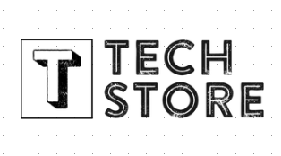

<p align="center">

</p>

# TechStock

TechStock es una aplicación de consola desarrollada como parte de un proyecto de curso, enfocada en gestionar el control de stock de productos tecnológicos y los estados de cuenta de clientes y proveedores. La aplicación maneja la lógica necesaria para realizar compras, ventas y actualizaciones de inventario de manera eficiente. A medida que continúa en desarrollo, se añaden nuevas funcionalidades para mejorar la experiencia de usuario y optimizar el flujo de trabajo en la gestión del inventario. Este proyecto refleja el aprendizaje práctico adquirido durante el curso.

## Comenzando 🚀

Este proyecto esta desarrollado en python 3.11.5 y requiere la instalación de las siguientes dependencias:

1. Descargar el repositorio

Primero, clona este repositorio en tu máquina local. Abre una terminal y ejecuta el siguiente comando:

```
git clone https://github.com/usuario/techstock.git

```
Cambia al directorio del proyecto:

```
cd techstock

```


2. Crear y activar un entorno virtual (venv)

    *Para asegurarse que las dependencias esten aisladas de las dependencias del sistema operativo, se recomienda crear un entorno virtual.
    ejecutar el siguiente comando ebnn tu consola de comandos*

```
python3.11 -m venv venv

```

Luego, activa el entorno virtual:

En Windows:

```
.\venv\Scripts\activate

```

En MacOS/Linux:

```
source venv/bin/activate
```

3. instalar las dependencias
    *Para instalar las dependencias, ejecuta el siguiente comando en la terminal*

```
pip install -r requirements.txt
```
4. Ejecutar el proyecto
    *Para ejecutar el proyecto, ejecuta el siguiente comando en la terminal*

```
python main.py
``` 


### Pre-requisitos 📋

_Que cosas necesitas para instalar el software y como instalarlas_

```
Da un ejemplo
```

### Instalación 🔧

_Una serie de ejemplos paso a paso que te dice lo que debes ejecutar para tener un entorno de desarrollo ejecutandose_

_Dí cómo será ese paso_

```
Da un ejemplo
```

_Y repite_

```
hasta finalizar
```

_Finaliza con un ejemplo de cómo obtener datos del sistema o como usarlos para una pequeña demo_

## Ejecutando las pruebas ⚙️

_Explica como ejecutar las pruebas automatizadas para este sistema_

### Analice las pruebas end-to-end 🔩

_Explica que verifican estas pruebas y por qué_

```
Da un ejemplo
```

### Y las pruebas de estilo de codificación ⌨️

_Explica que verifican estas pruebas y por qué_

```
Da un ejemplo
```

## Despliegue 📦

_Agrega notas adicionales sobre como hacer deploy_

## Construido con 🛠️

_Menciona las herramientas que utilizaste para crear tu proyecto_

* [Dropwizard](http://www.dropwizard.io/1.0.2/docs/) - El framework web usado
* [Maven](https://maven.apache.org/) - Manejador de dependencias
* [ROME](https://rometools.github.io/rome/) - Usado para generar RSS

## Contribuyendo 🖇️

Por favor lee el [CONTRIBUTING.md](https://gist.github.com/villanuevand/xxxxxx) para detalles de nuestro código de conducta, y el proceso para enviarnos pull requests.

## Wiki 📖

Puedes encontrar mucho más de cómo utilizar este proyecto en nuestra [Wiki](https://github.com/tu/proyecto/wiki)

## Versionado 📌

Usamos [SemVer](http://semver.org/) para el versionado. Para todas las versiones disponibles, mira los [tags en este repositorio](https://github.com/tu/proyecto/tags).

## Autores ✒️

_Menciona a todos aquellos que ayudaron a levantar el proyecto desde sus inicios_

* **Andrés Villanueva** - *Trabajo Inicial* - [villanuevand](https://github.com/villanuevand)
* **Fulanito Detal** - *Documentación* - [fulanitodetal](#fulanito-de-tal)

También puedes mirar la lista de todos los [contribuyentes](https://github.com/your/project/contributors) quíenes han participado en este proyecto. ---
