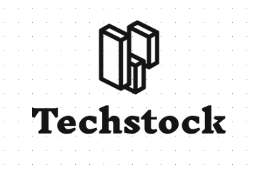

<p align="center">
  
</p>

<h1 style="text-align: center;">TechStock</h1>

TechStock es una aplicación de consola desarrollada como parte de un proyecto de curso, enfocada en gestionar el control de stock de productos tecnológicos y los estados de cuenta de clientes y proveedores. La aplicación maneja la lógica necesaria para realizar compras, ventas y actualizaciones de inventario de manera eficiente. A medida que continúa en desarrollo, se añaden nuevas funcionalidades para mejorar la experiencia de usuario y optimizar el flujo de trabajo en la gestión del inventario. Este proyecto refleja el aprendizaje práctico adquirido durante el curso.

## Comenzando 🚀

Este proyecto esta desarrollado en python 3.11.5 y requiere la instalación de las siguientes dependencias:

1. Descargar el repositorio

Primero, clona este repositorio en tu máquina local. Abre una terminal y ejecuta el siguiente comando:

```
git clone https://github.com/usuario/techstock.git

```
Cambia al directorio del proyecto:

```
cd techstock

```


2. Crear y activar un entorno virtual (venv)

    *Para asegurarse que las dependencias esten aisladas de las dependencias del sistema operativo, se recomienda crear un entorno virtual.
    ejecutar el siguiente comando ebnn tu consola de comandos*

```
python3.11 -m venv venv

```

Luego, activa el entorno virtual:

En Windows:

```
.\venv\Scripts\activate

```

En MacOS/Linux:

```
source venv/bin/activate
```

3. instalar las dependencias
    *Para instalar las dependencias, ejecuta el siguiente comando en la terminal*

```
pip install -r requirements.txt
```
4. Ejecutar el proyecto
    *Para ejecutar el proyecto, ejecuta el siguiente comando en la terminal*

```
python main.py
``` 


### Pre-requisitos 📋


### Instalación 🔧


## Despliegue 📦

_Agrega notas adicionales sobre como hacer deploy_

## Construido con 🛠️


